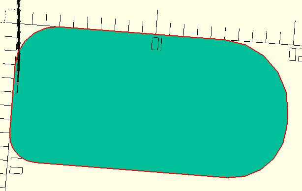
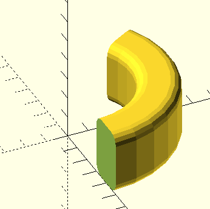
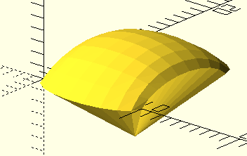

# akabe.scad

My OpenSCAD library.

## 2D objects

### rect_fillet



```scad
include <akabe.scad/fillet.scad>;
rect_fillet(10, 20, ul=5, ur=4, ll=3, lr=2);
```

## 3D objects

### cylinder_tube_fillet



```scad
include <akabe.scad/fillet.scad>;
cylinder_tube_fillet(h=30, r=50, hole_radius=30, angle=120, ui=5, li=5, uo=5, lo=5);
```

### Bezier surface



```scad
include <akabe.scad/bezier.scad>;

points = [
  [0, 0, 0], [0, 2, 2], [0, 8, 2], [0, 10, 0],
  [0, -3, 0], [2, 2, 5], [2, 8, 5], [0, 13, 0],
  [10, -3, 0], [8, 2, 5], [8, 8, 5], [10, 13, 0],
  [10, 0, 0], [10, 2, 2], [10, 8, 2], [10, 10, 0]
];
top_edges = bezier_get_top_edge_indices(10);
bottom_edges = bezier_get_bottom_edge_indices(10);
left_edges = bezier_get_left_edge_indices(10);
right_edges = bezier_get_right_edge_indices(10);
polyhedron(
  points = concat(bezier_surface_points(points, 10), [[5, 5, -5]]),
  faces = concat(
    bezier_surface_triangles(10),
    [
      for (i = [0:len(top_edges)-2]) [100, top_edges[i], top_edges[i+1]],
      for (i = [0:len(bottom_edges)-2]) [100, bottom_edges[i+1], bottom_edges[i]],
      for (i = [0:len(left_edges)-2]) [100, left_edges[i+1], left_edges[i]],
      for (i = [0:len(right_edges)-2]) [100, right_edges[i], right_edges[i+1]],
    ]));
```
